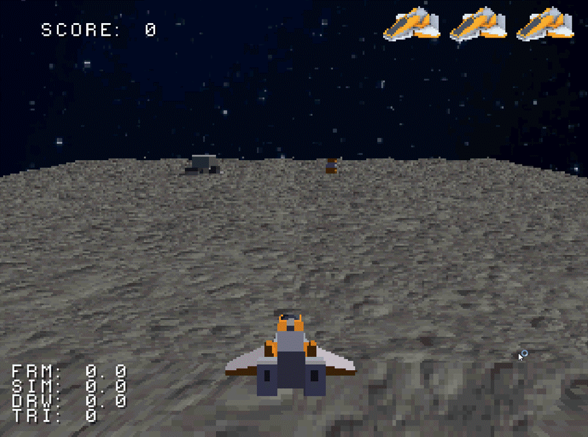

# Tundra
Tundra is the **runtime** part of a general-purpose 3D game engine for the **first generation of PlayStation consoles** (PlayStation 1 / PSX), along with a few CLI tools to ease development and use of the engine. It uses C++20 and [psn00bsdk](https://github.com/Lameguy64/PSn00bSDK) as its underlying SDK, but currently it only supports Windows.

The engine was created as part of my Master's thesis, and as such, the engine is limited in features, has multiple hacky solutions and there are many things I would do differently. This repository is not under further development, as I'm planning on rebooting the project. The new repository will be linked to here. 

While it *was* and *can be* used for developing a game with, doing so you will likely run into unknown bugs, weird behavior or missing features that I cannot promise to fix or help out with. So use it at your own discretion.

One small game made with the engine is [Color Cannon Coop](https://jesperpapiorgmailcom.itch.io/colorcannoncoop) made at *Nordic Game Jam 2024*.

### Content

- [Thesis](#Thesis)
- [Acknowledgements](#Acknowledgements)
- [Features](#Features)
- [How to use](#How-to-use)
  - [Game setup](#Game-setup)
  - [General code pointers](#General-code-pointers)
  - [Setup and game loop](#Setup-and-game-loop)
  - [Assets](#Assets)
  - [Entity system](#Entity-system)
  - [Transforms](#Transforms)
  - [Rendering](#Rendering)
  - [Sound](#Sound)
  - [Input](#Input)
  - [Utility](#Utility)
- [Development on the engine](#Development-on-the-engine)
- [Benchmarks](#Benchmarks)

## **Thesis**

This engine was created as the core part of my Master's thesis in MSc in Games (technology track) at IT University of Copenhagen in fall of 2024. 

In practice, I primarily desired to spend my time on developing an engine. Formally, however, the thesis was motivated by there not being any general-purpose game engines for the original PlayStation out there (to my knowledge). It seems this is in part because of the technical limitations of the console, but I'm not entirely convinced that is reason enough for one to not to exist, and so I sought to answer the following hypothesis:

> What are the technical capabilities of a general-purpose 3D game-engine for the original PlaySta-
> tion?

The final report can be found in the root of the repository ([thesis.pdf](thesis.pdf)).


## Acknowledgements

The development of this work has relied on the aid of various people:

- [PSX.Dev Discord server](https://discord.gg/QByKPpH) for answering questions (in particular *Nicolas Noble*, *spicyjpeg*, stenzek and Melchior)
- The PSX community in general for keeping this console alive and developing projects, tools and sharing knowledge which has been very essential for this project
- *Mike 'gwald' Garcia* and *Martin 'nocash' Korth* for feedback on the project over at [psxdev.net](https://www.psxdev.net/forum/viewtopic.php?f=62&t=4144)
- Jesper, Freddy and Noah for helping me testing out the engine at *Nordic Game Jam 2024*

and various projects:

- [psn00bsdk](https://github.com/Lameguy64/PSn00bSDK) (by Lameguy64, Spicyjpeg and more)
- [PCSX Redux](https://github.com/Lameguy64/PSn00bSDK) (including *PSyqo*) (by Nicolas Noble and more)
- [NOTPSXSerial](https://github.com/JonathanDotCel/NOTPSXSerial/blob/master/LICENSE) (by JonathanDotCel, Sktichin and more)
- [Unirom](https://unirom.github.io/) (by Nicolas Noble, JonathanDotCel, ABelliquex and more)
- [PlayStation Specifications](https://github.com/psx-spx/psx-spx.github.io/graphs/contributors) (originally by Martin 'nocash' Korth, edited and hosted by Nicolas Noble, spicyjpeg, kraptor and more)
- [DuckStation](https://github.com/stenzek/duckstation) (by stenzek)

If you feel you have contributed, and I have left you out, I deeply apologize and will rectify it if you reach out to me.

## Features

- Game object system using *entities* and *components* 

- Renderer supporting textured/untextured and smooth/flat shaded 3D models, 2D sprites, 2D debug text (psn00bsdk's debug text), cameras, layers and directional lighting.

- 3D transform system accelerated by GTE

- Asset compiler from raw assets (.obj, .png, .wav etc.) to native engine formats, including simple loading of those assets in in engine

- Input system for original controller (not analog)

- Sound system to play 23 looping and one-off sounds simultaneously plus 1 music track

- Hardware accelerated matrices and vector classes

- Fixed-point type including fixed point math

- Time/clock system

- Various other utility (strings, list, debug asserts, to-string functionality)

- Automated test system (mostly for engine development)

  

### Missing features and limitations

- No physics system
- No animations
- No concept of a "scenes"
- The entire game is packed into a single binary that is fully loaded at startup, which means
  - The entire game (including assets) is limited to 2 megabytes
  - All assets have to be loaded into RAM, even those that are just loaded into video and sound RAM.
  - There is no audio streaming, significantly limiting the size potential of music
- No advanced audio support (no stereo, no spatial sounds, no procedural sound effects)
- The renderer is not particularly optimized, and only utilizes trivial culling mechanisms.
- No C++ standard template library (STL), and only limited custom substitutes
- No support for other controllers than original (only digital mode)


## How to use


### Game setup

The engine utilizes [Visual Studio Code](https://apps.microsoft.com/detail/xp9khm4bk9fz7q?hl=en-US&gl=US) (or a fork, such as [VSCodium](https://vscodium.com/)) and the emulator [PCSX Redux](https://github.com/grumpycoders/pcsx-redux) for its workflows, and a game project is setup using the [Tundra game template](https://github.com/maltebp/tundra-template).

#### Setup tools

**VS Code**

1. Install [Visual Studio code](https://code.visualstudio.com/Docs/setup/setup-overview)
2. Install [Native Debug](https://marketplace.visualstudio.com/items?itemName=webfreak.debug) extension
3. Install [clangd](https://marketplace.visualstudio.com/items?itemName=llvm-vs-code-extensions.vscode-clangd) extension
4. Optional: Install [CMake](https://marketplace.visualstudio.com/items?itemName=twxs.cmake) extension (for syntax highlighting in CMake files used for project configurations)

**PCSX Redux**

1. Download [PCSX Redux](https://distrib.app/pub/org/pcsx-redux/project/dev-win-x64) (topmost) - it does not matter to the engine where you put it
2. Open the emulator
3. Press escape to show the top bar and open *Configuration > Emulation*
4. Toggle *Enable Debugger* **on**
5. Toggle *Enable GDB Server* **on**
6. Toggle *Dynarec CPU* **off**

#### Setup game project

1. Download the [Tundra game template](https://github.com/maltebp/tundra-template) (download as Zip and extract it or fork it the repository)
2. Rename the folder to your game project (no spaces)
   - This just changes the name of your ISO files (and the name of your game project folder for your own convenience).

The project template contains simple white cube assets, which it renders and rotates. 

#### Project structure

- `assets/` is where you put your raw asset files (.png, .obj, .wav)
  - Currently, contains the simple white cube model
  - How you structure this is up to you
- `src/` is where you put your source code
  - Currently it sets up a camera, loads the cube model asset, constructs an entity with a `Model` component with the cube model, rotates it continuously and displays a `Hello. world!` text.
- `sources.cmake` is a list of all source files (`.cpp`) that must be included in the game
- `assets.cmake` is a list of all asset files and their configurations (see the [Assets section](#Assets))
- `tools/` contains the build scripts
- `external/` contains the built engine

#### Building the game

The game is built from a *command-line interface* (CLI) using batch scripts

- Open you terminal (e.g. Command Prompt)
- Navigate to your game project folder
- Run `tools\build\generate.bat`
  - This is only needed if you have never built before or added a new source file to `sources.cmake` or a new asset to `assets.cmake`
- Run `tools\build\build.bat <config>` where `<config>` is either `debug` or `release` (`release` has full code optimization and removes all assertions).

#### Running and debugging the game in *emulator*

You run the game in the emulator through Visual Studio Code:

- Build your game (see [Building the game](#Building the game))
- Open *PCSX Redux*
- In Visual Studio Code, open the *Run and Debug* side-panel (press `Ctrl + Shift + D` )
- Select either `Game (Redux, Debug)` and `Game (Redux, Release)`

Game should now start in the emulator, and Visual Studio Code has a debugger attached.

**Disclaimer: **The debugger is a bit wonky and unstable, so use at your own discretion (e.g. you cannot set breakpoints while it is running, you cannot always see the callstack and it may break at a different line than where you have put your breakpoint).

#### Running and debugging on *hardware*

Running it on *hardware* is a bit more complicated and a bit unstable workflow, and is therefor not fully described here. But in short:

- You must have a memory card with [Unirom](https://unirom.github.io/) installed
  - Or a modchipped PlayStation and a CD with Unirom installed
- A [USB to PlayStation's serial cable](https://www.schnappy.xyz/?building_a_serial_psx_cable) (which must be custom-made)
- Download [NOTPSXSerial](https://github.com/JonathanDotCel/NOTPSXSerial) (`nops`) to connect to PlayStation
- To debug you
  - Connect PlayStation and PC using serial cable
  - Start *Unirom* on the PlayStation
  - Run `nops` in terminal: `nops /fast /gdb 127.0.0.1:3334 COM3 /m`
  - In Visual Studio Code (with your project open) run the `Game (Hardware, Debug)` or `Game (Hardware, Release)` configurations.

You can also burn the game the onto a physical disk, by using the image file, which is automatically built in the build-step and to be found as `build/<project_name>.bin` and `build/<project_name>.cue` (this require you to modchip or softmod your hardware).


### General code pointers

- Types are in `PascalCase`, functions, members, namespaces and variables are in `lower_case_snake_case`, and macros are in `CAPITALIZED_SNAKE_CASE`

- All Tundra types and functions exist in the `td` namespace

- All Tundra macros start with `TD_`

- Everything in `td::internal` and headers in an `internal` folder is not intended to be used by the user

- All Tundra headers exist in `<tundra/...>`

- There is no particular pattern in subfolders in `<tundra/...>`

- Headers may be split into three parts, with each parts including the ones above:

  - `header.fwd.hpp`: contains only forward declarations of types and global functions
  - `header.dec.hpp`: contains *definition* of types (structs and classes), but only *declarations* of member functions
  - `header.hpp`: contains full definition of class methods (unless they exist in a `.cpp` file)

  Compilation times may improve drastically, if you only include what you need, instead of including `header.hpp` every time.

### Setup and game loop

To use the engine, you must not provide your own `main` function, but instead it is started by including the `<tundra/startup.hpp>` in some translation unit, and defining the following two functions and global variable:

```c++
// Read by engine before init
const td::EngineSettings ENGINE_SETTINGS { };

// Run at start-up
void initialize(td::EngineSystems& engine_systems) { }

// Run every frame (game loop)
void update(td::EngineSystems& engine_systems, const td::FrameTime& frame_time) { }
```

The `engine_systems` arguments holds references to all the engine systems (asset loader, time, input, sound player).

**Note:** These are already defined in the Tundra game template.

### Assets

The engine supports automatic compilation and inclusion of raw assets (`.png`, `.obj`, `.wav`) to formats that the engine can load and use. 

#### Include asset

Assets are added in the `assets.cmake` file like so:

```cmake
set(ASSETS
	<asset>
	...
	<asset>
)
```

Each `<asset>` is of the format:

```cmake
<type> <code-name> <path> <param> ... <param>
```

where

- `type`: type of the asset, is either `MODEL`, `TEXTURE` or `SOUND`
- `code-name`: the name of the global variable in code pointing to the asset data
- `path`: path to the asset, relative to the asset directory
- `param`: optional parameters on the asset, depending on the asset type (see assets types below)


#### Using asset

To use the asset in code, you must first create an external global variable using the *code name* you gave the asset:

```c++
extern "C" const td::uint8 <code name>[];
```

The asset must then be loaded using the `AssetLoader`:

```c++
extern void initialize(td::EngineSystems& engine_systems) {
    td::AssetLoader& asset_loader = engine_systems.asset_loader;
    
    td::ModelAsset* model = asset_loader.load_model(<code name>);
    td::TextureAsset* texture = asset_loader.load_texture(<code name>);
    td::SoundAsset* sound = asset_loader.load_sound(<code name>);
}
```

#### Textures

Textures are compiled using [img2tim](https://github.com/Lameguy64/img2tim) and thus supports any file type that it supports (tested with `.png` and `.jpg`), but they are limited to 256x256 pixels.

By default they are compiled as *full-color* textures (every pixel has a distinct color), but you can compile it using a palette instead (CLUT) to reduce the size by specifying either of the following parameters:

- `PALETTE4`: image has at most 16 colors
- `PALETTE8`: image has at most 256 colors

#### Models

Models must be in OBJ format and are compiled using a custom compiler.

It does not support all features of OBJ, but it supports the following:

- Normals
- Indexed mode for vertices, UVS and normals
- Textures (see below)
- Diffuse material color
- Smooth and flat shading

**With texture**

If a model has a texture, UVs will be automatically compiled, but the texture must be included separately. In code, when loading the model, the loaded texture must be passed as a parameter to `load_model`.

#### Sound

Sounds must be in 16-bit PCM `.wav` format with a single channel (mono), and are compiled using [es-ps2-vag-tool](https://github.com/eurotools/es-ps2-vag-tool).

A sound can be marked as looping by specifying the `LOOP` parameter. There is no distinction between music and sound effects, but sounds used for music must be looping.


### Entity system

The game object system consists of two concepts: *components* and *entities*.

- *Component*: customizable data type (through inheritance) to which arbitrary systems can apply behavior through iteration.
- *Entity*: a group of component.

The relevant headers are  found in: `<tundra/engine/entity-system/..>`

#### Defining custom component

```c++
class MyComponent : public td::Component<MyComponent> {
public 
	int value;  
};
```

#### Creating component/entity

```c++
td::Entity* entity = td::Entity::create();
MyComponent* my_component = entity->add_component<MyComponent>();
my_component->value = 42;
```

#### Deleting component/entity

```c++
my_component->destroy(); // Only destroys this component
entity->destroy(); // Also destroys all components on entity
```

#### **Applying behavior**

Components have no "update" function (like you see in Unity). Instead, behavior is applied to components by iterating all components of a given type:

```c++
void bar() {
	for( MyComponent* my_component : MyComponent::get_all() ) {
        my_component->value++;
    }
}
```

This provides flexibility, as it allows any system to apply any logic to any number of components any number of times.

#### Component references

Entity and component memory addresses are stable, so you can safely store their pointers. But the system also has a *reference count* mechanism, that allows you to avoid [dangling pointers](https://en.wikipedia.org/wiki/Dangling_pointer) by using the `ComponentRef` class. The `ComponentRef` will automatically be `nullptr` if the component that it references is destroyed.

```c++
#include <tundra/engine/entity-system/component-ref.hpp>

td::Entity* entity = td::Entity::create();
MyComponent* my_component = entity->add_component<MyComponent>();
td::ComponentRef<MyComponent> ref = my_component;

if( ref != nullptr ) {
    TD_DEBUG_LOG("Ref is valid");
}

my_component->destroy();

if( ref == nullptr ) {
    TD_DEBUG_LOG("Ref is invalid");
}
```

*Things to be aware of*

- There can be at most 255 references to the same component
- A `ComponentRef` will clear its reference count to a component when the reference is accessed and the component is destroyed, and while any `ComponentRef` has a reference to a component, its memory will not be freed (it will be destroyed though).
- Because entities are technically also components, you can also have a `td::ComponentRef<td::Entity>`


### Transforms

In Tundra, the entity system has no inherent knowledge of the concept of transforms. Instead, transforms are just regular components. Meaning that an entity can have an arbitrary number of transforms.

#### Transform types

There are 2 types of transforms:

- **`DynamicTransform`**: Can have a parent and children, and can be changed after constructing (92 bytes). Useful for moving objects (e.g. player)
- **`StaticTransform`**: Cannot have a parent nor children, and it must given its matrix at construction (44 bytes). Useful for environment (e.g. a tree or rock).

Both transforms inherit the abstract `Transform` class. Other components that needs a transform (such as a `Model`) require an `Transform` in its constructor.

*Example:*

```c++
td::Entity* entity = td::Entity::create();
td::DynamicTransform* transform_1 = entity->add_component<td::DynamicTransform>();
td::DynamicTransform* transform_2 = entity->add_component<td::DynamicTransform>();
td::StaticTransform* transform_3 = entity->add_component<td::StaticTransform>(..);

transform_1->add_child(transform_2);
```


#### Transform matrices

To retrieve the *local-to-world* matrix, or the `TransformMatrix`, of a transform and use it to transform a vector you may use the hardware accelerated computation functions:

```c++
#include <tundra/gte/compute-transform.hpp>

td::Transform* transform = /* ... */;

td::TransformMatrix world_matrix = td::gte::compute_world_matrix(transform);

td::Vec3<td::Fixed16<12>> v = /* ... */;
Vec3<Fixed32<12>> v_world = td::gte::apply_transform_matrix(world_matrix, v);
```

`DynamicTransform` caches its transform matrix, meaning it will only be calculated when needed and only recomputed if it has changed (various optimizations are done here to limit what is recomputed).

The `StaticTransform` stores its matrix directly, and thus involves no computation. This can also be fetched directly.

The header also contains other transform matrix functions, including multiplication of matrices, extraction of rotation matrices and computation of the inverse transform matrix.

### Rendering

The engine automatically runs the rendering logic after the `update(..)` function has been called. You utilize the rendering features by

- Adjusting lighting settings in the `RenderSystem` accessed via the `EngineSystems` (ambient lighting and 3 directional lights are available)
- Setup a `Camera` component along with *layer settings*
- Create *renderable components* that are either Model`, `Sprite` and `Text`

#### Camera

To render anything you must create at least one `Camera` component, which is assigned a `Transform` at construction. For every camera, every renderable component is rendered in relation to the camera's transform position and view direction. The camera's view direction is the camera's local negative z-axis (engine uses *right-handed* coordinate system).

```c++
auto layer_settings = // ... See below
    
td::Entity* camera_entity = td::Entity::create();

td::DynamicTransform* camera_transform = 
    camera_entity->add_component<td::DynamicTransform>();

td::Camera* camera = 
    camera_entity->add_component<td::Camera>(camera_transform, layer_settings);
```

The renderer automatically picks up every camera, so there is no need to register it with the renderer.

You can manually manipulate the camera's transform to change its view direction, but you can also use the `look_at` function:

```c++
camera->transform->set_translation({1, 0, 1})
camera->look_at({0, 0, 0 });
```

#### Layers

All renderable components are assigned to a *layer*, which is just an integer ID, and a camera has a list of layers that it renders.

**Note:** Because you currently cannot set which part of the framebuffer that a camera renders to, the multiple camera functionality is not all that useful (e.g. you cannot do split screen or a rearview camera).

Every camera can setup its own depth settings for every layer: how far it renders and the resolution of the depth (number of distinct depth values in the depth range). Increasing the resolution, increases the memory overhead of the camera (2 bytes per value). 

*Example:*

```c++
const td::uint32 LAYER_UI = 0;
const td::uint32 LAYER_WORLD = 1;
const td::uint32 LAYER_GROUND = 2;

td::List<td::CameraLayerSettings> layer_settings;
layer_settings.add({LAYER_UI, 1});
layer_settings.add({LAYER_WORLD, 2048});
layer_settings.add({LAYER_GROUND, 128});

camera_entity->add_component<td::Camera>(
    camera_transform, 
    layer_settings
);
```

#### Models

Models are instances of 3D `ModelAsset`s, including various instance settings such as a transform and tint.

```c++
td::Entity* entity = td::Entity::create();

td::Transform* transform = /* .. */;
td::uint32* layer = /* .. */;
td::ModelAsset* model_asset = /* .. */;

td::Model* model = entity->add_component<td::Model>(
    model_asset,
    layer, 
    transform
);
```

#### Sprites

Sprites are instances `TextureAsset`'s' in screen space including various instance settings such as position, rotation, size and tint.

```c++
td::uint32* layer = /* .. */;
td::TextureAsset* texture = /* .. */;

td::Entity* e = td::Entity::create();
td::Sprite* sprite = e->add_component<td::Sprite>(layer);
sprite->texture = texture;
sprite->size = { 32, 32 };
sprite->position = { 64, 64 };
```

Screen space is 320x240 with (0, 0) being top left and (320,240) being bottom right.

#### Text

Tundra does not have proper UI text support, but it exposes *psn00bsdk*'s *debug font* API via the component system.

```c++
td::uint32* layer = /* .. */;

td::Entity* entity = td::Entity::create();
td::Text* text_component = entity->add_component<td::Text>(layer);
text_component->text = "Hello word!";
text_component->position = { 64, 64};
```

The text is limited in that you cannot change the text's font, size, color or rotation.

### Sound

To play sound you must use the `SoundPlayer` provided with the `EngineSystems`, and you can play either music or sound effects.

Example:

```c++
td::SoundAsset* my_sound_effect;
td::SoundAsset* my_music;

void update(td::EngineSystems& engine_systems, const td::FrameTime& frame_time) { 
	
    td::uint32 play_id = engine_systems.sound_player.play_sound(my_sound_effect);
    engine_systems.sound_player.stop_sound(play_id);
    
    engine_systems.play_music(my_music);
    engine_systems.stop_music();
}
```

- Whether the sound is looping is given by the sound asset (see [Assets](#Assets))

### Input

Input is handled by polling the state of either of the two controllers (`IController`) in the `Input` class provided by the `EngineSystems`.

Example:

```c++
void update(td::EngineSystems& engine_systems, const td::FrameTime& frame_time) { 
	
    IController& controller_1 = engine_systems.input.controller_1;
    IController& controller_2 = engine_systems.input.controller_2;
    
    if( controller_1.is_pressed(td::Button::R1) ) {
        if( controller_1.is_pressed_this_frame(td::Button::Circle) ) {
            // Circle is pressed this frame (and not last frame) while R1 is 			 	// being pressed
        }
    }
	
    if( controller_2.is_active() ) {
        if( controller_2.is_pressed(td::Button::Cross) ) {
            // Cross is pressed on controller 2
        }
    }
}
```


### Utility

The engine contains various utility, some of which covers the lack of an STL implementation. All of these utility classes exists in `<tundra/core/...>` headers


#### Fixed-point class

Header: `<tundra/core/fixed.hpp>`

The PlayStation does not have hardware support for floating point numbers and instead uses [fixed point numbers](https://en.wikipedia.org/wiki/Fixed-point_arithmetic). Tundra has a some types two template types to represent such numbers: a 16-bit type `Fixed16<TNumFractionBits>` and a 32-bit type `Fixed32<TNumFractionBits>`.

The most common value for `TNumFractionBits` is 12, as that is what is used by the PlayStation hardware.

They support most of the operators you will need such as addition, subtraction, multiplication and casts in a type-safe manner.

##### Constructing

Integers (both constant expressions and non-constant expressions) can implicitly be cast to a fixed-pointer number:

```c++
int i = /* value from somewhere */;
td::Fixed16<12> f = 15;
td::Fixed32<12> f = i;
```

This cast incurs a single bit-shift.

You can construct a fixed-point number from a `double` value that is a constant expression, such as a `double` literal using the `td::to_fixed`:

```c++
td::Fixed32<12> f = td::to_fixed(12.5);
```

This is a `consteval` API that ensures the constant expression double is converted to a fixed-point type at compile time.

##### Math

The `<tundra/core/math.hpp>` includes various math functions that operates on the fixed-point types, including `sin`, `cos`, `abs` and so on. These implementations are from [fpm](https://github.com/MikeLankamp/fpm/blob/master/include/fpm/math.hpp) repository.

#### List

Header: `<tundra/core/list.hpp>`

Just a simple *dynamic array* implementation with geometric growth. This is the only container provided by engine.

```c++
td::List<int> l;
l.reserve(16);
l.add(10);
bool was_removed = l.remove(12);
int index = l.index_of(10);
bool contains = l.contains(42);
l.clear();
```

#### String

*Header: `<tundra/core/string.hpp>`*

A dynamic character array implementation very similar to `std::string`.

``` c++
td::String s = "Hello, ";
td::String s2 = "World!";
td::String s3 = s1 + S2;
```

##### From format

Using the header `<tundra/core/string-util.hpp>`, you can create a `td::String` from a string format (like `printf`):

```c++
td::String s = td::string_util::create_from_format("(%d, %d)", 10, 15);
```

##### To string

You can convert various primitives and types to a `td::String` using the specializations and overloads `td::to_string<T>`:

```c++
td::String s1 = td::to_string(10);

td::Fixed16<12> f = td::to_fixed(4.5);
td::String s2 = td::to_string(f);
```

You can implement a specialization for this function for you own types as well:

```c++
struct MyStruct {
	int i, j;
};

td::String td::to_string(const MyStruct& my_struct) {
	return td::string_util::create_from_format("(%d, %d)", i, j);
}
```

##### Debug log

To utilize `String` for printing, you can use the `TD_DEBUG_LOG` macro from `<tundra/core/log.hpp>` header. This uses `printf`-like formatting, but it can also print `String` objeccts and types that has a `td::to_string` implementation using the  `%s` format:

```c++
TD_DEBUG_LOG("%d", 42);

td::String s = "Hello world";
TD_DEBUGLOG("%s", s);

td::Fixed32<12> f = /* .. */;
TD_DEBUG_LOG("%s", f);
```

Debug logs are automatically compiled out when doing a *Release* build.

#### Debug asserts

*Header: `<tundra/core/assert.hpp>`*

Asserts whether a given expression is true, and if not, it will print the given message and halt the program:

```c++
int i = / * ... */;
int j = / * ... */;
TD_ASSERT(i == j, "%d does not equal %d", i, j);
```

Unfortunately, I did not get around to support the same functionality as with `TD_DEBUG_LOG`, so you must manually convert non-primitive objects and `td::String` to a C-strings:

```c++
td::String s = "Hello world";
TD_ASSERT(false, "%s", s.get_c_string());

td::Fixed32<12> f = /* .. */;
TD_ASSERT(false, "%s", td::to_string(f).get_c_string());
```

#### Matrices and vectors

*Headers: `<tundra/core/vec/vec3.hpp>`, `<tundra/core/vec/vec2.hpp>`, `<tundra/core/mat/mat3x3.hpp>`*

The engine contains some very simple template types for 2D and 3D vectors and 3x3 matrices that supports some simple addition, subtraction and comparison operations.

```c++
td::Vec3<int>`v1 { 1, 2, 3 };
td::Vec3<int>`v2 { 4 };
td::Vec3<int> v3 = v1 + v2;

td::Vec2<td::Fixed32<12>> v4;

td::Mat3x3<td::Fixed16<12>> m {
    1, 2, 3,
    4, 5, 6,
    7, 8, 9
};
```

##### Hardware acceleration

*Header: `<tundra/gte/operations.hpp>`*

A few *hardware accelerated* operations exists for specific combinations of `Vec3` and `Mat3x3` using `Fixed32` and `Fixed16` as template types, including multiplication, normalization and creation of a rotation matrix.

Example:

```c++
Mat3x3<Fixed16<12>> m1;
Mat3x3<Fixed16<12>> m2;

Mat3x3<Fixed16<12>> m3 = td::gte::multiply(m1, m2);
```


## Development on the engine

This contains information on how to develop the engine, which is an unlikely use-case as the repository is discontinued. But for preservation, and in case some one wants to fork it and make some changes, I put a guide for it here.

### Setup

Development on the engine requires the same tools (VS Code and emulator) as for developing games, so see the [Setup tools](#Setup-tools) section for this.

You must also install [Visual Studio 2022](https://visualstudio.microsoft.com/). 

Besides that, you only need to clone the repository - all other dependencies, including *CMake*, SDK and debugger, are included in the repository.

### Project structure

The engine's projects, source code and tests are split in three *layers*:

- `playstation`: runs on the PlayStation (e.g. has dependencies on the PlayStation)
- `developer`: runs on the developers platform (e.g. tools such as the model compiler)
- `base`: used for both the developers and PlayStation layers (i.e. cross-platform)

`playstation` and `developer` does not depend on each other, but both depends on `base`.

The *physical layout* of the engine mostly follows [The Pitchfork Layout](https://joholl.github.io/pitchfork-website/):

- `include`: Contains all the API headers (i.e. the ones that the game will include)
  - This is split into `base`, `developer` and `playstation`
  - These headers cannot include anything from `src`
  - Anything in `include/base/core/` must not include anything outside that folder
- `src`: Contains all the source and header files that are not part of the engine API
  - Can include headers from `include`
- `tests`: contains test source code and data
  - `tests/data/`: assets used for tests
  - `tests/automated/`: source code for tests that can be run and validated automatically (e.g. unit tests) using the custom testing framework
    - One folder for each layer
  - `tests/manual/`: more complex tests that must be run and validated manually (i.e. sandbox-like projects)
    - One folder for each layer
- `tools`:
  - `build`: Contains the CMake project files for each of the projects (instead of putting them in `src`) as well as batch scripts for generating and building the different projects. There is a folder for each of the  three components (`base`, `developer`, `playstation`)
  - `cmake`: Contains some CMake used across CMake projects
- `external`: contains all the external dependencies for the engine, including both tools and libraries
- `.vscode`: it is intentional that this is included in the repository as it contains debugging configurations and *clangd* settings (for syntax highlighting)


### Build

The engine is built with *batch* scripts through a terminal (like the game):

1. Open the `tundra` repository folder in your terminal
2. Build the developer layer (only contains *asset compiler* required for tests):
   1. Run `tools\build\developer\generate`
   2. Run `tools\build\developer\build debug`
   3. Run `tools\build\developer\build release`
3. Build the engine 
   1. Run `tools\build\playstation\generate`
   2. Run `tools\build\playstation\build debug`
   3. Run `tools\build\playstation\build release`

#### Deploy (full build)

You can "deploy" the engine, which will build everything and generate an output folder with all the required libraries, headers and dependencies that a game needs:

1. Open the `tundra` folder in your terminal
2. Run `tools\build\deploy`
3. Output is put in `build\deploy\`


### Development environment

#### `playstation`

Developing the `playstation` layer, you must use *Visual Studio Code* which utilizes the *clangd* extension as a language server to provide syntax highlighting, code correction and suggestions.

#### `developer`

Developing the `developer` layer (currently only *asset compiler*), you must use *Visual Studio* and open the `build\developer\td.developer.sln`.

### Running tests

**Note:** The *base* layer contains many tests, but these are not run on their own. They are executed either on `developer` (Windows) or `playstation` (emulator or hardware) when running the tests for either layer.

#### `playstation`

1. Build the `playstation` projects (see above)
2. Open *PCSX Redux*
3. Open repository in *Visual Studio Code*
4. Open *Run and Debug* panel (`Ctrl + Shift + D`)
5. Select debug configuration:
   - `Automated Tests (<Redux|Hardware>, <Debug|Release>)`
     - Runs the automated tests on either hardware or in emulator (`Redux`). To run on hardware, see [Running and debugging on hardware](#Running-and-debugging-on-hardware)
   - `Tests: <Manual Test> (<Redux|Hardware>, Debug)`
     - Runs one of the manual tests (will produce some visual output in the emulator). Only `Debug` configuration exists for these for simplicity.
6. Press `Start Debugging` (green play button), or press `F5`

#### `developer`

1. Build the `developer` projects (see above)
2. Open `build\developer\td.developer.sln` solution in *Visual Studio*
3. Build solution (`Build > Build Solution`)
4. Run the `td.developer.tests.automated` project

**Note:** No manual tests exists for this layer at the moment.

#### Sandbox project

**Note:** You may want to setup a personal sandbox project where you can write ad-hoc tests to test changes made to the engine. You can do this using the Tundra game template (see the [Game Setup](#Game-setup) section), and update the engine using the guide below.

### Update engine in game 

To update the engine of the template repository, or a copy of it (i.e. a game or sandbox project), you must do the following:

- Setup the engine repository path for the game project (only once):

  - Create the file `<game_project>\tools\update-tundra\source-path`
  - In the file, paste the *full* path to the `tundra` repository (e.g. `C:\Users\malte\projects\tundra`)

- [Build and *deploy* the Tundra engine](#Deploy-(full-build))

- Update the game's engine:

  - Open game project folder in terminal
  - Run `tools\update-tundra\update`

- Re-generate and re-build your game

  

## Benchmarks

The GIF shows a demo of a short 15-seconds benchmarking game. 



### **Statistics**

The statistics are measured on an actual PlayStation model SCPH-7502 (PAL). They just gives a rough overview, and it is not a "real" game nor is it optimized, but the benchmark hints at what the engine is capable of.

- Runs at 25 FPS (common framerate for PSX games)
- 32 - 43 *model components* processed every frame
- 297 - 812 triangles rendered every frame
- 110 - 160 components simulated
- Render stage (submitting to GPU) takes 18.7 - 30.7 ms
- Rasterizing (GPU) takes 10.2 - 13.3 ms (runs in parallel with rest of frame)
- Simulation stage (movement, collision etc.) takes 5.2 - 7.8 ms
- Uses a total 250 KiB memory, including 121 KiB code and assets (rest is heap)
- 500 KiB VRAM used (~50%)
- 268 KiB SRAM used (~50%)

**Note:** The engine has few culling mechanism meaning even the invisible geometry incurs a significant cost.

### Asset credit

The demo uses assets from the [Space Kit](https://kenney.nl/assets/space-kit) by Kenney, along with some custom-made assets.

